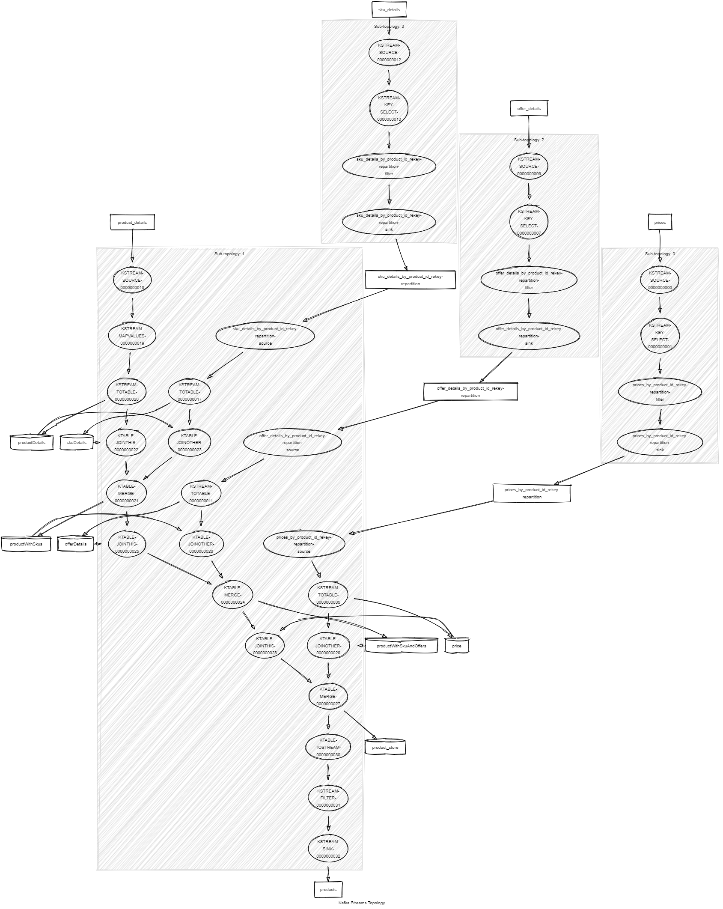

# KStream product merge example

[](https://travis-ci.com/adrien-ben/kstream-product-merge-example)

In this example we are going to merge product information coming from multiple topics.
Only product with the minimal required information (id, name and brand) will be outputted.

You can find a version using Avro as message format the the [avro branch](https://github.com/adrien-ben/kstream-product-merge-example/tree/avro).

And one using Protobuf as message format the the [protobuf branch](https://github.com/adrien-ben/kstream-product-merge-example/tree/protobuf).

## Input

We consume the product part from 4 different topics:

- `product_details` contains general information about a product:

```json
{
  "id": "P1",
  "name": "Wonderful thing",
  "description": "That's a wonderful thing, trust me...",
  "brand": "ShadyGuys"
}
```

The key of the message in Kafka will be the identifier of the product.

- `sku_details` contains general information about products variations.

```json
{
  "skuId": "S1P1",
  "productId": "P1",
  "name": "Blue wonderful thing",
  "description": "That's a wonderful thing, trust me..., and this one is blue !"
}
```

The key does not matter for our example.

- `offer_details` contains general information about skus offers.

```json
{
  "offerId": "O1S1P1",
  "productId": "P1",
  "skuId": "S1P1",
  "name": "Refurbished blue wonderful thing",
  "description": "That's a wonderful thing, trust me..., and this one is blue ! It should work too."
}
```

The key does not matter for our example.

- `prices` contains price information of the offers.

```json
{
  "offerId": "O1S1P1",
  "productId": "P1",
  "skuId": "S1P1",
  "amount": 19999.99
}
```

## Output

The merged products we be sent into the `products` topic.

```json
{
  "id": "P1",
  "name": "Wonderful thing",
  "description": "That's a wonderful thing, trust me...",
  "brand": "ShadyGuys",
  "skus": [
    {
      "id": "S1P1",
      "name": "Blue wonderful thing",
      "description": "That's a wonderful thing, trust me..., and this one is blue !",
      "offers": [
        {
          "id": "O1S1P1",
          "name": "Refurbished blue wonderful thing",
          "description": "That's a wonderful thing, trust me..., and this one is blue ! It should work too.",
          "price": 19999.99
        }
      ]
    }
  ]
}
```

## Implementation

One approach could be to join the multiple topics two-by-two.
This approach is not optimal because it would make our application generate multiple state store for each intermediate join operation.
And one changelog topic for each of them. This is not our approach.

We choose to stream each input topic and use the co-group method from the Kafka Streams DSL to merge all 4 topics using only one state-store.

To do that we fist need to re-key the various input by product id and send them through an intermediate topic
to ensure proper partitioning of the message.

## Topology



## Run the app 

```sh
# Run app
./mvnw spring-boot:run

# Run tests (note the clean to ensure the state store is cleaned up)
./mvnw clean test
```

You will also need a running Kafka instance. If you have docker installed this project has a
docker-compose file that starts a zookeeper, a kafka broker and kafkahq which is a nice ui
that ease the interaction with the kafka broker and that you can access at localhost:8090.

```sh
docker-compose up -d
```
